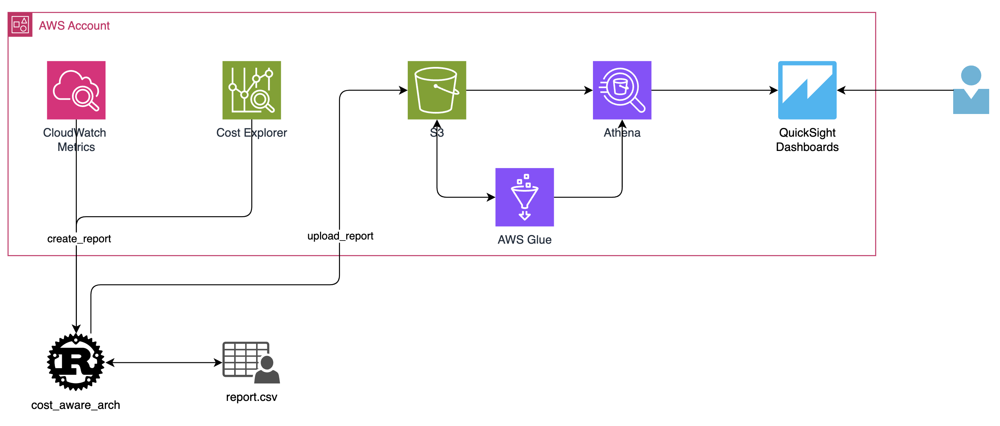
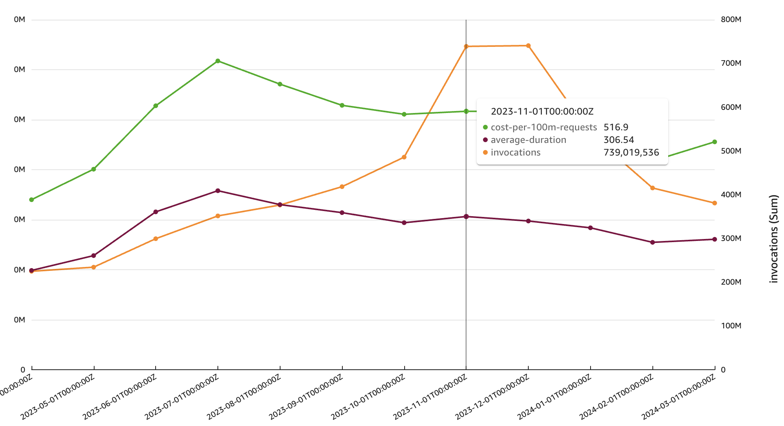

# Overview
Inspired by the laws outlined in the [Frugal Architecture](https://thefrugalarchitect.com/laws/make-cost-a-non-functional-requirement.html), this project attempts to support these laws, specifically I, II and IV - treating cost as a non-functional requirement and improving cost observability. 

## Context
The cost of infrastructure in isolation has no context, especially over time. Does it make sense that my cloud costs have increased, decreased, or even plateaued relative to previous months? The first phase of this program tries to provide some context for lambda based services. 

For a given service, the program will collect:
- total monthly costs
- total monthly invocations
- the average latency duration
- and calculate cost per requests - specifically: (monthly costs / monthly invocations) * 100M.

With these metrics plotted over time (months) it can highlight anomalies and more importantly that the chosen architecture is not scaling and/or [is no longer exploiting economies of scale (law II)](https://thefrugalarchitect.com/laws/systems-that-last-align-cost-to-business.html) 

For example:
- an increase in invocations, but no decrease in cost per requests *could* indicate that economies of scale are not being exploited.
- an increase in cost per requests, but no increase in invocations or duration (key factor for lambda based workloads) could indicate an anomaly (e.g. configuration change).
- an increase in duration should result in an increase in cost per requests, and therefore highlights the impact and explains why cloud costs have increased.

## Solution Design

### Component Responsibilities 
#### Cost Explorer & CloudWatch
Source of the metrics to build out the report. Querying with Cost Explorer is best (or only really only possible) with cost allocation tags. At the moment, the `cost_aware_arch` executable is hard coded to query costs by the `Name` tag, soon to become a command line argument. CloudWatch is queried for lambda invocations and duration by lambda name.

#### cost_aware_arch Executable
Support two commands:
- The `create-report` command pulls in the metrics and generates a `.csv`, breaking the metrics up by month.
- The `upload-report` command uploads the report to a S3 bucket ready to be queried by Athena.

#### Athena, Glue and QuickSight
The _visualization_ resources. Typical process looks like: Glue Crawler across the objects uploaded, allowing the `.csv` reports to queryable by Athena, and finally dashboards in Quick Sight.

# Getting Started

`./cost-aware-arch` executable supports the following commands:

```
Commands:
  create-report  Creates csv report
  upload-report  Uploads csv report to S3
  help           Print this message or the help of the given subcommand(s)
```

_For now_ the expectation is to create the report, and then upload.

## Create Report
The first step, creating the report. 

`./cost-aware-arch -p aws_profile_name -r aws_region -l lambda_name -t cost_allocation_tag_name_and_value create-report`

If execution is successful, a local `.csv` file is generated.

## Upload Report
Next step, uploading the report. 

`./cost-aware-arch -p aws_profile_name -r aws_region -l lambda_name -t cost_allocation_tag_name_and_value upload-report`

If execution is successful, the local `.csv` file is uploaded to S3.

## Visualizing via QuickSight Dashboards
Current state, this project doesn't build this infra, but a pattern to visualize is building Athena & Glue resources to support Quick Sight dashboards. The outcome can look like:

